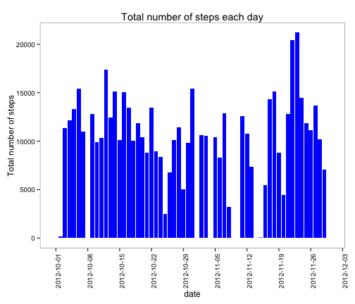
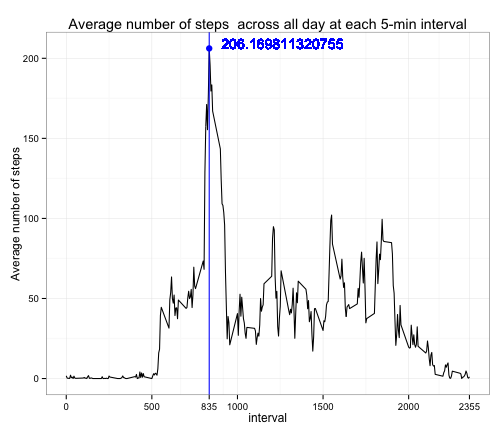
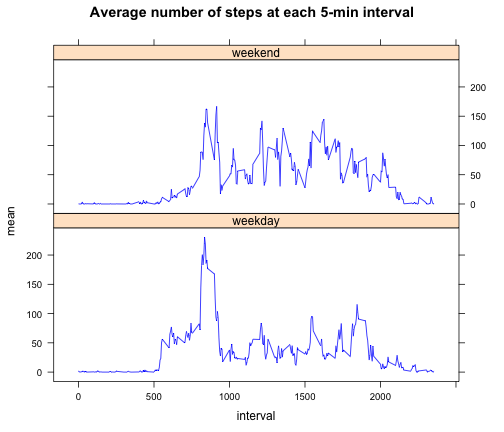

# Reproducible Research: Peer Assessment 1
====================================================================

### Loading and preprocessing the data
#### Assume dataset is in the current working directory

```r
unzip("activity.zip")
data <- read.csv("activity.csv")
data$date <- as.Date(data$date)
```


## What is mean and median total number of steps taken per day? 
### Create a dataset contains date and total number of steps taken per day

```r
library("plyr")
TstepAday <- ddply(data, .(date), summarize, total = sum(steps))
```

### Calculate mean and median

```r
mean(TstepAday$total, na.rm = T)
```

```
## [1] 10766
```

```r
median(TstepAday$total, na.rm = T)
```

```
## [1] 10765
```


### Make a histogram of the total number of steps taken each day

```r
library("ggplot2")
hist <- ggplot(TstepAday, aes(x = date, y = total)) + geom_histogram(stat = "identity", 
    binwidth = 1, fill = "blue", position = "dodge") + labs(title = "Total number of steps each day", 
    y = "Total number of steps") + scale_x_date(breaks = "1 week") + theme_bw() + 
    theme(panel.grid.minor = element_blank(), panel.grid.major = element_blank()) + 
    theme(axis.text.x = element_text(angle = 90))
print(hist)
```

 


## What is the average daily activity pattern?
### Create a dataframe contains average steps across all days for each 5-min interval

```r
AstepInt <- ddply(data, .(interval), summarize, mean = mean(steps, na.rm = TRUE))
```

### Time series plot: which 5-min interval has the maximum average steps

```r
timeplot <- ggplot(AstepInt, aes(x = interval, y = mean)) + geom_line() + 
labs(title = "Average number of steps  across all day at each 5-min interval", 
    y = "Average number of steps") + ##### annotate the plot
geom_vline(aes(xintercept = AstepInt[which.max(AstepInt$mean), 1]), colour = "blue") + 
    scale_x_continuous(breaks = c(0, 500, AstepInt[which.max(AstepInt$mean), 
        1], 1000, 1500, 2000, max(AstepInt$interval))) + annotate("point", x = AstepInt[which.max(AstepInt$mean), 
    1], y = max(AstepInt$mean), size = 3, colour = "blue") + geom_text(x = AstepInt[which.max(AstepInt$mean), 
    1], y = max(AstepInt$mean), size = 5, colour = "blue", label = max(AstepInt$mean), 
    vjust = 0, hjust = -0.1) + theme_bw()
print(timeplot)
```

 


## Imputing missing values

### The total number of missing values in the dataset (i.e. the total number of rows with NAs)

```r
sum(is.na(data$steps) == T)
```

```
## [1] 2304
```

### Impute missing values with mean of that 5-min interval
#### First subset missing data 

```r
imputedata <- data[is.na(data$steps) == T, ]
```

#### Then impute missing data with mean of corresponding 5-min intervals. Dataset AstepInt (created by previous step) contains average steps for each 5-min interval, so just use it to substitute the missing values for each date that contains missing data. 

```r
for (i in imputedata$date) {
    imputedata[imputedata$date == i, ][, 1] <- AstepInt[, 2]
}
```

#### Create a new dataset with imputed data

```r
newdata <- rbind(data[is.na(data$steps) == F, ], imputedata)
```

### Histogram of the total number of steps taken each day using new dataset

```r
TstepAday2 <- ddply(newdata, .(date), summarize, total = sum(steps))
```

```r
hist2 <- ggplot(TstepAday2, aes(x = date, y = total)) + geom_histogram(stat = "identity", 
    binwidth = 1, fill = "blue") + labs(title = "Total number of steps each day", 
    y = "Total number of steps") + scale_x_date(breaks = "1 week") + theme_bw() + 
    theme(panel.grid.minor = element_blank(), panel.grid.major = element_blank()) + 
    theme(axis.text.x = element_text(angle = 90))
print(hist)
```

 

### Calculate mean and median 

```r
mean(TstepAday2$total)
```

```
## [1] 10766
```

```r
median(TstepAday2$total)
```

```
## [1] 10766
```


### Conclusion
With imputed data, mean and median of the total number of steps per day are the same. Compared to previous results (with missing data), means stay the same, but median slightly changes.


## Are there differences in activity patterns between weekdays and weekends?

### Create a new factor variable in the dataset with two levels – “weekday” and “weekend” indicating whether a given date is a weekday or weekend day.

```r
library("chron")
newdata$weekday[is.weekend(newdata$date) == F] <- "weekday"
newdata$weekday[is.weekend(newdata$date) == T] <- "weekend"
```

### Time series plot

```r
AstepInt2 <- ddply(newdata, .(interval, weekday), summarize, mean = mean(steps))
```

```r
library("lattice")
AstepInt2 <- transform(AstepInt2, weekday = factor(weekday))
timeplot2 <- xyplot(mean ~ interval | weekday, data = AstepInt2, layout = c(1, 
    2), main = "Average number of steps at each 5-min interval", panel = function(x, 
    y, ...) {
    panel.lines(x, y, col = "blue")
})
print(timeplot2)
```

 


